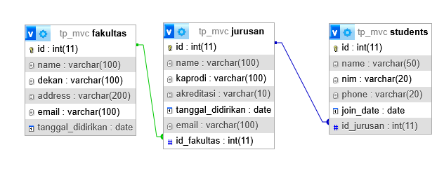

# Sistem Manajemen Mahasiswa dengan PHP Native MVC

## Janji
Saya Putra Hadiyanto Nugroho dengan NIM 2308163 mengerjakan Tugas Praktikum 8 dalam mata kuliah Desain dan Pemrograman Berorientasi Objek untuk keberkahanNya maka saya tidak melakukan kecurangan seperti yang telah dispesifikasikan. Aamiin.

## Deskripsi
Program ini adalah program CRUD data Mahasiswa, Fakultas, dan Jurusan menggunakan implementasi dari arsitektur Model-View-Controller (MVC) dalam PHP Native. Program ini juga memakai konsep OOP (Object-Oriented Programming) dan menggunakan database MySQL untuk menyimpan data.

## Struktur Database

Terdapat 3 tabel dalam database yang digunakan dalam aplikasi ini:
1. **Fakultas**, yang berisi data fakultas.
2. **Jurusan**, yang berisi data jurusan dan menggunakan relasi one to many dengan fakultas.
3. **Students**, yang berisi data mahasiswa dan menggunakan relasi one to many dengan jurusan.

## Struktur Desain Program

Program ini menggunakan arsitektur Model-View-Controller (MVC) dan konsep OOP (Object-Oriented Programming) dalam PHP. Berikut adalah penjelasan singkat tentang struktur desain program:
### 1. **Model**
   - Model bertanggung jawab untuk mengelola data aplikasi dan terhubung langsung dengan database.
   - File model diletakan di dalam folder `models`.
   - Terdapat parent Class `Database` yang mengatur koneksi awal ke database. Config database juga terdapat di dalam class ini.
   - Terdapat juga class `Fakultas`, `Jurusan`, dan `Mahasiswa` yang mewarisi class `Database` untuk mengelola data masing-masing tabel.

### 2. **View**
   - View bertanggung jawab untuk menampilkan dat kepada user.
   - Tiap tabel memiliki file view masing-masing yang diletakan di dalam folder `views`.
   - View tidak dapat berinteraksi langsung dengan database, ataupun Model, semua interaksi dilakukan melalui Controller.

### 3. **Controller**
   - Controller bertanggung jawab untuk menghubungkan Model dan View.
   - File controller diletakan di dalam folder `controller`.
   - Terdapat interface `Controller` yang mengatur method-method yang harus ada di dalam controller.
   - Setiap tabel memiliki controller masing-masing yang mengatur alur data antara Model dan View.
   - Untuk Index, Controller mendapatkan data dari Model dan mengirimkannya ke View untuk ditampilkan kepada pengguna.
   - Untuk Create, Update, dan Delete, Controller menerima input dari pengguna melalui View, memvalidasi data, dan kemudian memanggil Model untuk melakukann eksekusi ke Database.
   - Controller berhubungan langsung dengan Model untuk memproses data, dan juga dengan View untuk menampilkan hasilnya.

### 4. **Database**
   - Database yang digunakan adalah MySQL.
   - File `db.sql` berisi perintah SQL untuk membuat tabel-tabel yang diperlukan dalam aplikasi ini.
   - File tersebut diletakkan di dalam folder `database`.

### 5. **Addons**
   - Addons berisi file-file tambahan yang digunakan untuk mempercantik tampilan aplikasi.
   - Program ini menggunakan Bootstrap untuk framework CSS dan jQuery untuk interaksi pengguna.

## Penjelasan Alur Program

### 1. **Pemilihan Opsi**
   - Index berfungsi sebagai penerima permintaan dari pengguna dengan menggunakan method GET.
   - Format untuk URL adalah `index.php?tabel=nama_tabel&action=action&id=id`.
   - Defaultnya adalah mengakses tabel `students` dengan action `index`.
   - Setelah itu, index akan memanggil controller yang sesuai dengan tabel dan action yang diminta.
  
### 2. **Cara Kerja Controller**
   -  **Index**, controller akan mengambil data dari model dan akan mengirimkan data ke view menggunakan method `renderIndex()`.
   -  **Create**, apabila terdapat method POST, controller akan memanggil method `create()` pada model untuk menyimpan data ke database. Selain itu, controller akan memanggil method `renderCreate()` dari View untuk menampilkan form input data.
   -  **Update**, apabila terdapat method POST, controller akan memanggil method `update()` pada model untuk memperbarui data di database. Selain itu, controller akan megambil data dari Model dan memanggil method `renderUpdate()` dari View untuk menampilkan form input data yang sudah terisi.
   -  **Delete**, controller akan memanggil method `delete()` pada model untuk menghapus data dari database. Setelah itu, controller akan mengarahkan kembali ke index.

### 3. **Cara Kerja Model**
   - Model akan mengambil data dari database menggunakan query SQL.
   - Model menggunakan PDO untuk menghindari SQL Injection.
   - Method didalam Model akan return data dalam bentuk array jika berhasil, dan boolean false jika gagal.
   - Tiap method di dalam model akan dipanggil dan digunakan di Controller sesuai kebutuhan.

### 4. **Cara Kerja View**
   - View akan menerima data dari controller dan menampilkannya kepada pengguna.
   - Terdapat layout header dan footer yang terdapat di dalam folder `views/layouts`.
   - Tiap method dalam view merupakan tampilan yang berbeda, seperti `renderIndex()`, `renderCreate()`, dan `renderUpdate()`.
   - Tiap method ini akan dipanggil dari controller sesuai dengan action yang diminta oleh pengguna.

## Cara Menjalankan
1. Pastikan Anda memiliki server lokal seperti XAMPP.
2. Letakkan folder proyek ini di dalam direktori `htdocs`.
3. Import terlebih dahulu file `db.sql` ke dalam database MySQL Anda.
4. Akses aplikasi melalui browser dengan URL seperti `http://localhost/tp_mvc`.

## Dokumentasi

